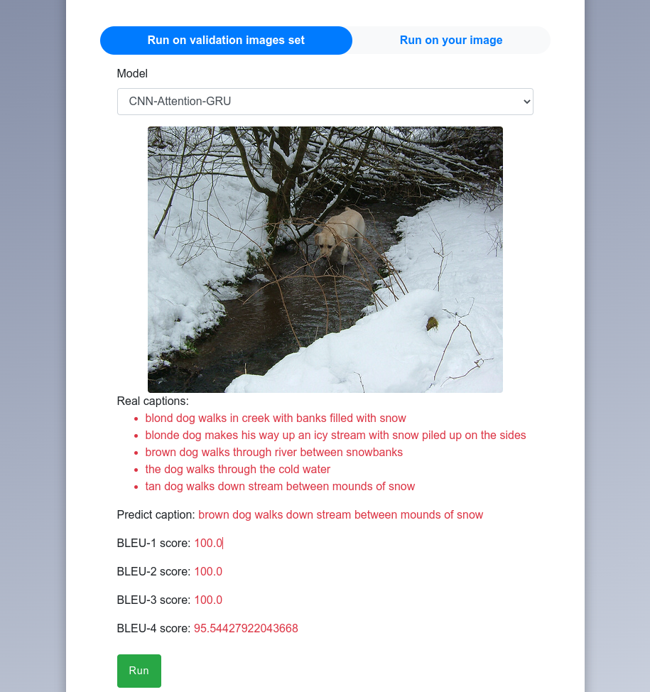
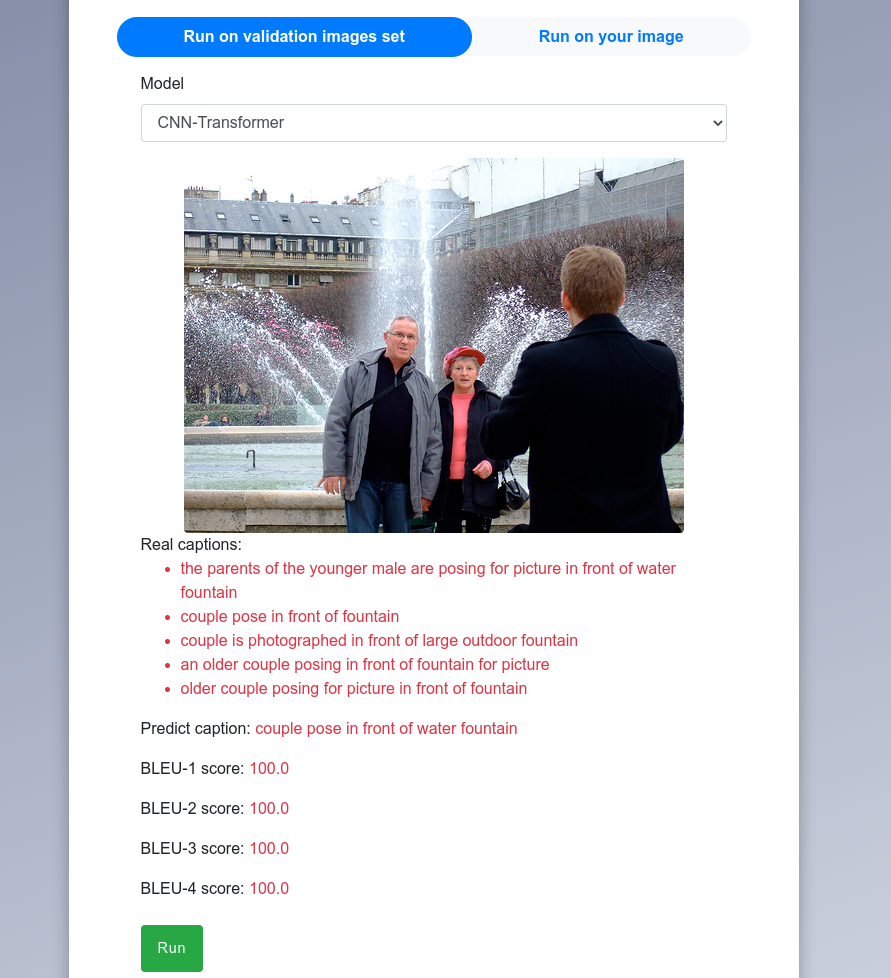
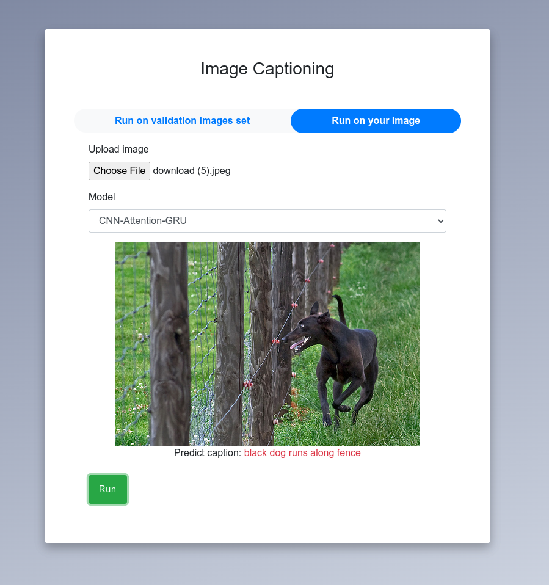
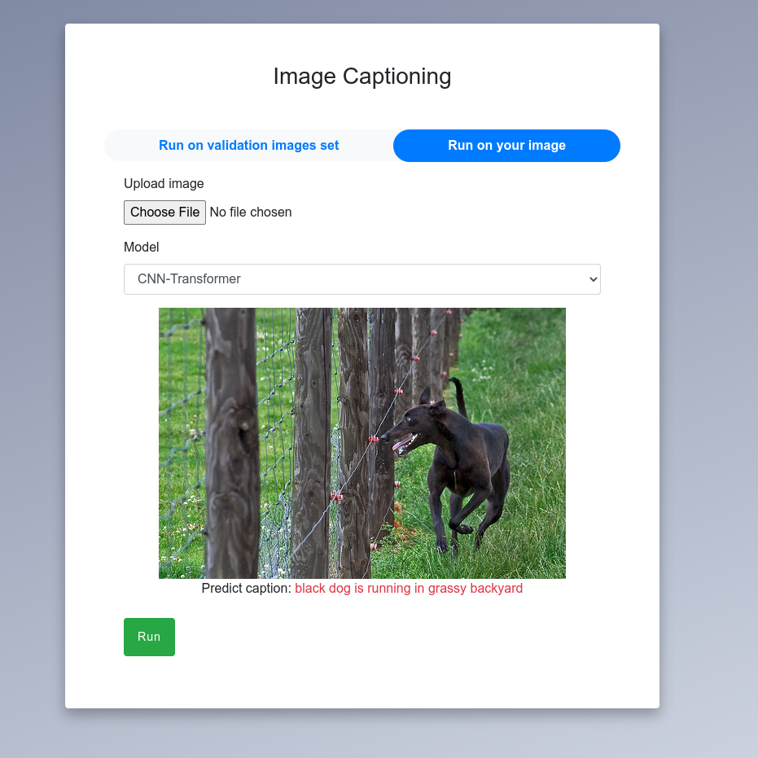

# Image Captioning using deep learning

## Introduction

This project aims to tackle the image captioning problem using two different architectures such as CNN-Attention-GRU and CNN-Transformer. The model is trained on the **Flickr8k** dataset. This dataset consists of 8091 color images. In the Flickr8k dataset, each image is associated with five different captions that describe the entities and events depicted in the image that were collected

## Usage

* First, clone the repository and enter the folder

```bash
$ git clone https://github.com/Nukukoricchio/image-captioning.git
$ cd image-captioning
$ unzip model/transformer/checkpoints.zip -d model/transformer/
```

* To install the required packages, run :

```bash
$ pip install -r requirements.txt
```

* To run development server

```bash
$ python manage.py runserver
```

Open Chrome or FireFox : **127.0.0.1:8000**

## Train model

* If you want to train the model yourself, you can run jupyter files in the **files** directory:  

## Web application

* You can choose to run the image caption generator with Flickr8k validation set or run with your own image
* You can choose to use the CNN-Attention-GRU architecture or the CNN-Transformer architecture
* When you run the image caption generator with Flickr8k validation set, some BLEU scores will be caculated

!(homepage)(files/home.png)

## Some demo results





* Video demo (https://www.awesomescreenshot.com/video/8068578?key=ac23c567ac464589f72e2b06f8feb026) 
